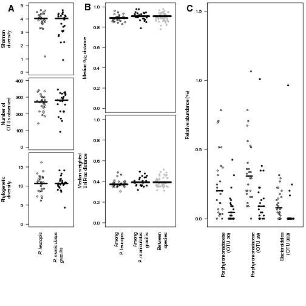
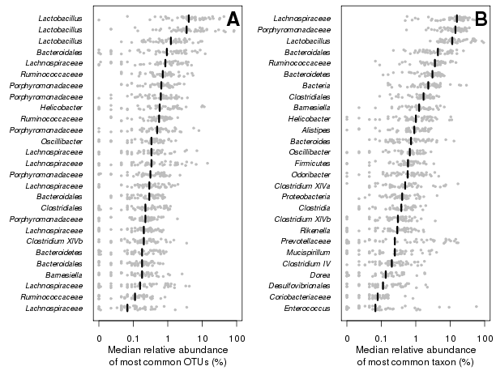

# Intra- and inter-individual variation masks inter-species variation in the microbiota of sympatric _Peromyscus_ populations  
Nielson T. Baxter, Judy J. Wan, Alyxandria M. Schubert, Matthew L. Jenior, Philip Myers, and Patrick D. Schloss

## Introduction
This is a digital notebook to accompany the paper titled, "Intra- and inter-individual variation masks inter-species variation in the microbiota of sympatric _Peromyscus_ populations" that will be published in *Applied & Environmental Microbiology*. It was written in [R markdown](http://rmarkdown.rstudio.com) and converted to html using the R knitr package. This enables us to embed the results of our analyses directly into the text to allow for a completely reproducible data analysis pipeline. A [github repository is available](https://github.com/schlossLab/wild_mice) where you can pull down your own version of the notebook to modify our analysis or adapt it to your analysis. 

This document was generated using [mothur v.1.34](http://www.mothur.org/wiki) and [R](http://www.r-project.org):


```r
deps = c("randomForest", "maps", "vegan", "date", "knitr");

for (dep in deps){
  if (dep %in% installed.packages()[,"Package"] == FALSE){
    install.packages(as.character(dep), quiet=TRUE);
  }
  library(dep, verbose=FALSE, character.only=TRUE)
}
```

```
## randomForest 4.6-10
## Type rfNews() to see new features/changes/bug fixes.
## Loading required package: permute
## Loading required package: lattice
## This is vegan 2.0-10
```

```r
sessionInfo()
```

```
## R version 3.0.1 (2013-05-16)
## Platform: x86_64-redhat-linux-gnu (64-bit)
## 
## locale:
##  [1] LC_CTYPE=en_US.UTF-8       LC_NUMERIC=C              
##  [3] LC_TIME=en_US.UTF-8        LC_COLLATE=en_US.UTF-8    
##  [5] LC_MONETARY=en_US.UTF-8    LC_MESSAGES=en_US.UTF-8   
##  [7] LC_PAPER=C                 LC_NAME=C                 
##  [9] LC_ADDRESS=C               LC_TELEPHONE=C            
## [11] LC_MEASUREMENT=en_US.UTF-8 LC_IDENTIFICATION=C       
## 
## attached base packages:
## [1] stats     graphics  grDevices utils     datasets  methods   base     
## 
## other attached packages:
## [1] date_1.2-34         vegan_2.0-10        lattice_0.20-29    
## [4] permute_0.8-3       maps_2.3-9          randomForest_4.6-10
## [7] knitr_1.6.21       
## 
## loaded via a namespace (and not attached):
## [1] evaluate_0.5.5 formatR_1.0    grid_3.0.1     stringr_0.6.2 
## [5] tools_3.0.1
```

```r
perm = 1e4
```

To convert the R markdown to html (or any other format), you'll also need to install the [SRA tools package](http://www.ncbi.nlm.nih.gov/books/NBK158900/) and have a live internet connection. You can make the conversion using the [knitr package](http://yihui.name/knitr/) from within R:


```r
knit2html("wild_mice.Rmd")
```

I have used the following knitr settings to compile this document:


```r
opts_chunk$set("fig.path"="figure/")
opts_chunk$set("fig.align"="center")
opts_chunk$set("dev" = c("png", "pdf"))

opts_chunk$set("tidy" = TRUE)

opts_chunk$set("echo" = TRUE)
opts_chunk$set("eval" = TRUE)
opts_chunk$set("warning" = FALSE)
opts_chunk$set("cache" = TRUE)
```

The goal of this document is to give a blow-by-blow accounting for how the analysis was done. Later in the document, we reproduce the text of the Results section of the paper where all of the numbers in the text are reproduced live. All of the commands below will work in a mac or linux environment. Some modification will be needed to get it to work in a windows environment.


## Data curation

Let's start by setting up our work area with a folder called `wild_mice`. We'll also need to get ahold of some reference files. First we'll get the SILVA-based bacterial reference alignment and trim it to the V4 region of the 16S rRNA gene.


```bash
wget http://www.mothur.org/w/images/9/98/Silva.bacteria.zip
unzip *zip
mv silva.bacteria/silva.bacteria.fasta ./
rm -rf silva.bacteria __MACOSX Silva.bacteria.zip

mothur "#pcr.seqs(fasta=silva.bacteria.fasta, start=11894, end=25319, keepdots=F, processors=8)"
mv silva.bacteria.pcr.fasta silva.v4.fasta

wget http://www.mothur.org/w/images/1/1a/Silva.eukarya.zip  
unzip *zip  
mv silva.eukarya/silva.eukarya.fasta ./  
rm -rf silva.eukarya __MACOSX Silva.eukarya.zip  
```

We'll need to get ahold of the RDP's classification training set that is based on the 16S rRNA gene:


```bash
wget http://www.mothur.org/w/images/5/59/Trainset9_032012.pds.zip
unzip *zip
rm Trainset9_032012.pds.zip
```

Finally, we generated an 18S rRNA gene sequence reference taxonomy based on the SILVA taxonomy:


```bash
wget http://www.mothur.org/WildPeromyscusStudy/v4.eukarya.tgz
tar xvzf v4.eukarya.tgz
rm v4.eukarya.tgz
```

### Getting data out of the SRA
Now that we're into the `wild_mice` folder, we're ready to pull down the sequence data from NCBI's Short Read Archive (SRA). This is not a trivial process. The data is available in an html format on the NCBI's [SRA website](http://www.ncbi.nlm.nih.gov/sra/?term=SRP044050). It would be pretty tedious to pull down the 222 files individually. Let's not do that. Instead we'll use the command line `wget` function to pull the files down and then put the individual `*.sra` files into the top level of our `wild_mice` folder:


```bash
wget -r ftp://ftp-trace.ncbi.nlm.nih.gov/sra/sra-instant/reads/ByStudy/sra/SRP/SRP044/SRP044050/*
mv ftp-trace.ncbi.nlm.nih.gov/sra/sra-instant/reads/ByStudy/sra/SRP/SRP044/SRP044050/SRR1506*/*sra ./
rm -rf ftp-trace.ncbi.nlm.nih.gov
```

At this point, the `wild_mice` folder should contain 222 files that end in `*.sra`. Now we need to convert these files into paired `*.fastq` files using the `fastq-dump` command line program, which comes with the SRA toolbox:


```bash
for SRA in *.sra
do
fastq-dump $SRA --split-files
done
```

Now we have 444 files that end in `*_1.fastq` and `*_2.fastq`. These correspond to the first and second reads off of the MiSeq. Unfortunately, we don't really know which of these files correspond to our original sample identifiers. Thankfully, the SRA will provide us with the sequencing metadata that we deposited with the sequence data. Let's pull those down:


```bash
wget -O ./SRP044050_info.csv 'http://trace.ncbi.nlm.nih.gov/Traces/sra/sra.cgi?save=efetch&db=sra&rettype=runinfo&term=SRP044050'
```

This creates the `SRP044050_info.csv` file that will allow us to map the sequencing metadata to our samples as well as indicating to us which samples were generated by sequencing the 16S rRNA gene or the 18S rRNA gene. We will use R to generate two files that will be used in mothur to tell the make.contigs command which fastq files are to be merged to generate each sample. We'll also use the original sample names instead of the SRA-generated run names:


```r
run.info <- read.csv(file = "SRP044050_info.csv", header = T, stringsAsFactors = F)
run.16S.info <- run.info[grepl("16S", run.info$LibraryName), ]
run.18S.info <- run.info[grepl("18S", run.info$LibraryName), ]

files.16S <- cbind(run.16S.info$LibraryName, paste0(run.16S.info$Run, "_1.fastq"), 
    paste0(run.16S.info$Run, "_2.fastq"))
write.table(files.16S, file = "wild_mice.16S.files", quote = F, row.names = F, 
    col.names = F, sep = "\t")

files.18S <- cbind(run.18S.info$LibraryName, paste0(run.18S.info$Run, "_1.fastq"), 
    paste0(run.18S.info$Run, "_2.fastq"))
write.table(files.18S, file = "wild_mice.18S.files", quote = F, row.names = F, 
    col.names = F, sep = "\t")
```

Now that we have `wild_mice.16S.files` and `wild_mice.18S.files` we are ready to assemble the reads into contigs.

### Processing 16S and 18S rRNA gene sequence data in mothur
Using the deltaQ method described in the [Kozich et al. manuscript](http://www.ncbi.nlm.nih.gov/pmc/articles/PMC3753973/) we will assemble the paired reads into contigs


We can clean things up a bit and move all of the `*.sra`, `*.fastq`, and the `SRP044050_info.csv` files to a folder for raw data.


```bash
mkdir sra_files
mv *.sra *.fastq SRP044050_info.csv sra_files
```

First, we'll analyze the 16S rRNA gene sequence data and put all of the resulting files into a folder called `16S.analysis`. These commands come from the outline described in the [MiSeq SOP](http://www.mothur.org/wiki/MiSeq_SOP).


```bash
echo "unique.seqs(fasta=wild_mice.16S.trim.contigs.fasta);
summary.seqs(fasta=current, processors=8);
screen.seqs(fasta=current, name=current, group=wild_mice.16S.contigs.groups, summary=current, maxambig=0, maxhomop=8, maxlength=275);
count.seqs(name=current, group=current);
align.seqs(fasta=current, reference=silva.v4.fasta);
summary.seqs(count=current);
screen.seqs(fasta=current, count=current, start=1968, end=11550);
filter.seqs(vertical=T, trump=.);
unique.seqs(fasta=current, count=current);
pre.cluster(fasta=current, count=current, diffs=2);
chimera.uchime(fasta=current, count=current, dereplicate=t);
remove.seqs(fasta=current, accnos=current);
summary.seqs(fasta=current, count=current);
classify.seqs(fasta=current, count=current, reference=trainset9_032012.pds.fasta, taxonomy=trainset9_032012.pds.tax, cutoff=80);
remove.lineage(fasta=current, count=current, taxonomy=current, taxon=Chloroplast-Mitochondria-unknown-Archaea-Eukaryota);

cluster.split(fasta=current, count=current, taxonomy=current, splitmethod=classify, taxlevel=4, cutoff=0.15);
make.shared(list=current, count=current, label=0.03);
classify.otu(list=current, count=current, taxonomy=current, label=0.03);

phylotype(taxonomy=current, label=1);
make.shared(list=current, count=current);
classify.otu(list=current, taxonomy=current);

dist.seqs(fasta=current, output=lt);
clearcut();" > mothur.16S.batch

mothur mothur.16S.batch

mkdir 16S.analysis
mv *.16S.* 16S.analysis
```

Next, we'll analyze the 18S rRNA gene sequence data and put all of the resulting files into a folder called `18S.analysis`. These commands come from the outline described in the [MiSeq SOP](http://www.mothur.org/wiki/MiSeq_SOP). Because the reads do not fully overlap, we know that our error rate will be significantly higher than that of the 16S rRNA gene sequence data we generated. Therefore, we will only use classification-based analyses. The purpose of sequencing the 18S rRNA gene was to allow us to see what the mice had been eating at the time we sampled their microbiota. Therefore, we remove a lot of sequences that wouldn't indicate components of their diet.


```bash

echo "screen.seqs(fasta=wild_mice.18S.trim.contigs.fasta, group=wild_mice.18S.contigs.groups, contigsreport=wild_mice.18S.contigs.report, maxambig=0, maxlength=450, minoverlap=20, maxhomop=8, processors=8);
unique.seqs(fasta=current);
count.seqs(name=current, group=current);
align.seqs(fasta=current, reference=silva.eukarya.fasta);
summary.seqs(count=current);
screen.seqs(fasta=current, count=current, start=13876, end=22449);
filter.seqs(vertical=T, trump=.);
unique.seqs(fasta=current, count=current);
pre.cluster(fasta=current, count=current, diffs=2);
chimera.uchime(fasta=current, count=current, dereplicate=t);
remove.seqs(fasta=current, accnos=current);
summary.seqs(fasta=current, count=current);

classify.seqs(fasta=current, count=current, reference=v4.eukarya.fasta, taxonomy=v4.eukarya.tax, cutoff=80);
remove.lineage(fasta=current, count=current, taxonomy=current, taxon=Mammalia-Amoebozoa-Cryptophyceae-Excavata-SAR-Nematoda-Rotifera-Tardigrada-Archaeorhizomyces-LKM11-LKM15-uncultured-Chlorophyta-Eukaryota;unclassified;-Archaeplastida;unclassified-Eukaryota;Opisthokonta;Fungi;unclassified;-Opisthokonta;unclassified);
phylotype(taxonomy=current, label=1);
make.shared(list=current, count=current);
classify.otu(list=current, count=current, taxonomy=current);" > 18S.mothur.batch

mothur 18S.mothur.batch

mkdir 18S.analysis;
mv *.18S.* 18S.analysis
```

Viola! We're good to go. The main files that we will use from these pipelines will be:

* 16S rRNA gene sequence data (see the `16S.analysis` folder):
```
    #Genus-level analaysis
    wild_mice.16S.trim.contigs.unique.good.good.filter.unique.precluster.pick.pds.wang.pick.tx.1.cons.taxonomy
    wild_mice.16S.trim.contigs.unique.good.good.filter.unique.precluster.pick.pds.wang.pick.tx.shared
    
    #OTU-based analysis
    wild_mice.16S.trim.contigs.unique.good.good.filter.unique.precluster.pick.pick.an.unique_list.0.03.cons.taxonomy
    wild_mice.16S.trim.contigs.unique.good.good.filter.unique.precluster.pick.pick.an.unique_list.shared
    
    #Phylogenetic analysis
    wild_mice.16S.trim.contigs.unique.good.good.filter.unique.precluster.pick.pick.phylip.tre
```
* 18S rRNA gene sequence data (see the `18S.analysis` folder):
```
    #Genus-level analaysis
    wild_mice.18S.trim.contigs.good.unique.good.filter.unique.precluster.pick.eukarya.wang.pick.tx.1.cons.taxonomy
    wild_mice.18S.trim.contigs.good.unique.good.filter.unique.precluster.pick.eukarya.wang.pick.tx.shared
```

## Data analysis
Now that all the boring sequence curation is over, we're ready to analyze the data. Before we get going, we need to get the metadata file. You can get that from our github respository:


```bash
wget https://raw.githubusercontent.com/SchlossLab/wild_mice/master/wild.metadata.txt
```

What follows is the exact text from the Results section with the R code that was used to generate the numbers (including P-values) and all figures.

### Field capture of *Peromyscus* spp.


```r
md <- read.table(file = "wild.metadata.txt", header = T)
rownames(md) <- md$Group
nsamples <- nrow(md)
o <- order(rownames(md))
md <- md[o, ]

md$Date <- sub("_(\\d)$", "_0\\1", md$Date)

months <- format(ISOdate(2004, 1:12, 1), "%B")
names(months) <- as.character(1:12)

start <- sort(md$Date)[1]
start <- unlist(strsplit(start, "_"))
start <- paste(months[start[1]], start[2])

end <- sort(md$Date)[nrow(md)]
end <- unlist(strsplit(end, "_"))
end <- paste(months[end[1]], end[2])

eartag.species <- table(md$ET, md$SP)
samples.per.species <- apply(eartag.species, 2, sum)
indiv.per.species <- apply(eartag.species > 0, 2, sum)

indiv.multiple <- sum(table(md$ET) > 1)


# layout the 20 by 20 sampling grid
north_south <- c(DD = 1, CC = 2, BB = 3, AA = 4, A = 5, B = 6, C = 7, D = 8, 
    E = 9, F = 10, G = 11, H = 12, I = 13, J = 14, K = 15, L = 16, M = 17, N = 18, 
    O = 19, P = 20)

# extract the row information from the letters that are in the Station
# column of the metadata file
row <- north_south[gsub("(\\D+)\\d+", "\\1", md$Station)]

# extract the column information from the numbers that are in the Station
# column of the metadata file
column <- as.numeric(gsub("\\D+(\\d+)", "\\1", md$Station))

# calculate the distance between all pairs of samples
distance.matrix <- matrix(rep(0, nsamples * nsamples), nrow = nsamples)
for (i in 1:nsamples) {
    for (j in 1:nsamples) {
        distance.matrix[i, j] <- sqrt((row[i] - row[j])^2 + (column[i] - column[j])^2)
    }
}
rownames(distance.matrix) <- md$Group
colnames(distance.matrix) <- md$Group
distance.matrix <- distance.matrix * 20  # the cells are on 20-m intervals

# we'd like to keep a copy of the distance matrix around so that we can see
# whether there are any geographic correlations with community similarity
write(file = "grid.dist", ncol(distance.matrix))
write.table(distance.matrix, "grid.dist", quote = F, col.names = F, append = T)

# let's look at the samples collected from the same individuals first we
# count the number of samples per each ear tag
et.count <- table(md$ET)

# now we pull their samples names off - these represent the ear tags with
# duplicate samples
dup.et <- names(et.count[et.count > 1])

dist.travel <- numeric()
# cycle through the ear tags with duplicates finding the distance between
# that ear tag's samples
for (et in dup.et) {
    samples <- md[md$ET == et, "Group"]  #pull out the sample ids that correspond to that ear tag
    
    for (i in 1:(length(samples) - 1)) {
        # pull out those distances and concatenate them into a single vector
        dist.travel <- c(dist.travel, distance.matrix[samples[i], samples[i + 
            1]])
    }
}
```

Between May 25 and July 14, 2010 we used live traps to capture and release PL and PMG from sites within a 400 m by 400 m grid (20 m intervals) within Pigeon River State Forest in Cheboygan County, MI. Because animals were given ear tags at the initial capture event, we were able to document the animals that were captured multiple times. We obtained 58 fecal samples from 26 PL animals and 53 fecal samples from 23 PMG animals. Among the samples from animals captured multiple times (N=29 animals), the median distance between successive re-sampling events was 45 m (minimum=0 m, maximum=362 m). When we overlaid the species of _Peromyscus_ on the sampling grid, we were unable to detect variation in the range of the mice supporting the notion that the habitats of these mice overlapped (Figures 1A and 1B).


```r
# the PL grid
pl_grid <- matrix(rep(0, 20 * 20), nrow = 20)
rownames(pl_grid) <- 1:20
colnames(pl_grid) <- 1:20

# the PMG grid
pmg_grid <- matrix(rep(0, 20 * 20), nrow = 20)
rownames(pmg_grid) <- 1:20
colnames(pmg_grid) <- 1:20

# fill the counts
for (i in 1:nsamples) {
    # grid[row[i],column[i]] <- grid[row[i],column[i]]+1
    if (md$SP[i] == "PL") {
        pl_grid[row[i], column[i]] <- pl_grid[row[i], column[i]] + 1
    } else {
        pmg_grid[row[i], column[i]] <- pmg_grid[row[i], column[i]] + 1
    }
}

gray <- gray.colors(max(c(pl_grid, pmg_grid)) + 1, 1, 0)
heatmap(t(pl_grid), col = gray, scale = "n", Rowv = NA, Colv = NA, symm = T, 
    revC = T, labRow = names(north_south), margins = c(10, 6))
```


```r
heatmap(t(pmg_grid), col = gray, scale = "n", Rowv = NA, Colv = NA, symm = T, 
    revC = T, labRow = names(north_south), margins = c(10, 6))

ch.col <- gray
nSquares <- length(gray)
delta <- 0.05
i <- (0:(nSquares - 1)) * delta

text(x = mean(i), y = -0, label = "Number of animals", xpd = T)
rect(i - delta/2, (-0.08), i + delta/2, -0.08 + delta, col = gray, border = "black", 
    xpd = T)
text(x = i, y = -0.08, label = 0:(nSquares - 1), xpd = T, pos = 1)
```


### Host species does not affect microbiota structure


```r
# build design files for running homova
sample <- paste0(rownames(md), "_16S")
write.table(file = "wild.species.design", cbind(as.character(sample), as.character(md$SP)), 
    row.names = F, col.names = F, quote = F)
write.table(file = "wild.sex.design", cbind(as.character(sample), as.character(md$Sex)), 
    row.names = F, col.names = F, quote = F)
```


```bash
echo "sub.sample(shared=16S.analysis/wild_mice.16S.trim.contigs.unique.good.good.filter.unique.precluster.pick.pick.an.unique_list.shared, size=4463);
	summary.single(shared=current, subsample=4463, calc=sobs-shannon-nseqs, iters=100)
	dist.shared(shared=current, calc=thetayc, subsample=4463, iters=100, output=square, processors=8)

	sub.sample(shared=16S.analysis/wild_mice.16S.trim.contigs.unique.good.good.filter.unique.precluster.pick.pds.wang.pick.tx.shared, size=4463);
	summary.single(shared=current, subsample=4463, calc=sobs-shannon-nseqs, iters=100)
	dist.shared(shared=current, calc=thetayc, subsample=4463, iters=100, output=square, processors=8)
	
	summary.single(shared=16S.analysis/wild_mice.16S.trim.contigs.unique.good.good.filter.unique.precluster.pick.pds.wang.pick.tx.shared, subsample=4463, calc=sobs, iters=100)

	unifrac.weighted(tree=16S.analysis/wild_mice.16S.trim.contigs.unique.good.good.filter.unique.precluster.pick.pick.phylip.tre, count=16S.analysis/wild_mice.16S.trim.contigs.unique.good.good.filter.unique.precluster.uchime.pick.pick.count_table, distance=square, subsample=4463, iters=100)
	phylo.diversity(tree=current, count=current, iters=100, rarefy=T)

	homova(phylip=16S.analysis/wild_mice.16S.trim.contigs.unique.good.good.filter.unique.precluster.pick.pick.an.unique_list.0.03.subsample.thetayc.0.03.square.ave.dist, design=wild.species.design, iters=10000)
	homova(phylip=16S.analysis/wild_mice.16S.trim.contigs.unique.good.good.filter.unique.precluster.pick.pick.phylip.tre1.weighted.ave.dist, design=wild.species.design, iters=10000)

  get.communitytype(shared=16S.analysis/wild_mice.16S.trim.contigs.unique.good.good.filter.unique.precluster.pick.pick.an.unique_list.0.03.subsample.shared, processors=1);

	dist.shared(shared=18S.analysis/wild_mice.18S.trim.contigs.good.unique.good.filter.unique.precluster.pick.eukarya.wang.pick.tx.shared, calc=thetayc, subsample=500, iters=100, output=square, processors=8)
	sub.sample(shared=18S.analysis/wild_mice.18S.trim.contigs.good.unique.good.filter.unique.precluster.pick.eukarya.wang.pick.tx.shared, size=500)
	get.communitytype(shared=current, processors=1)" > mothur.analysis.batch

mothur mothur.analysis.batch
```


```r
# otu.alpha diversity analysis
otu.alpha <- read.table(file = "16S.analysis/wild_mice.16S.trim.contigs.unique.good.good.filter.unique.precluster.pick.pick.an.unique_list.0.03.subsample.groups.ave-std.summary", 
    header = T)
otu.alpha <- otu.alpha[otu.alpha$method == "ave", ]
rownames(otu.alpha) <- gsub("_16S", "", otu.alpha$group)
o <- order(rownames(otu.alpha))
otu.alpha <- otu.alpha[o, ]
otu.alpha <- otu.alpha[, -c(1, 2, 3)]

stopifnot(sum(rownames(md) != rownames(otu.alpha)) == 0)  #make sure everything is in the same order

sobs.anova <- summary(aov(rank(otu.alpha$sobs) ~ md$SP * md$Sex + Error(md$ET)))
summary(aov(rank(otu.alpha$sobs) ~ md$SP * md$Sex + Error(md$ET)))
```

```
## 
## Error: md$ET
##       Df Sum Sq Mean Sq
## md$SP  1  699.6   699.6
## 
## Error: Within
##               Df Sum Sq Mean Sq F value Pr(>F)  
## md$SP          1    672     672   0.665  0.417  
## md$Sex         1   1953    1953   1.932  0.167  
## md$SP:md$Sex   1   3463    3463   3.426  0.067 .
## Residuals    106 107158    1011                 
## ---
## Signif. codes:  0 '***' 0.001 '**' 0.01 '*' 0.05 '.' 0.1 ' ' 1
```

```r
shannon.anova <- summary(aov(rank(otu.alpha$shannon) ~ md$SP * md$Sex + Error(md$ET)))
summary(aov(rank(otu.alpha$shannon) ~ md$SP * md$Sex + Error(md$ET)))
```

```
## 
## Error: md$ET
##       Df Sum Sq Mean Sq
## md$SP  1   3148    3148
## 
## Error: Within
##               Df Sum Sq Mean Sq F value Pr(>F)
## md$SP          1    367   366.9   0.360  0.550
## md$Sex         1   1733  1732.6   1.700  0.195
## md$SP:md$Sex   1    666   666.0   0.653  0.421
## Residuals    106 108047  1019.3
```

```r
pd <- read.table(file = "16S.analysis/wild_mice.16S.trim.contigs.unique.good.good.filter.unique.precluster.pick.pick.phylip.1.phylodiv.rarefaction", 
    header = T, row.names = 1)
pd.final <- as.vector(t(pd["4463", ]))
names(pd.final) <- gsub("^X(.*)_16S", "\\1", colnames(pd))
o <- order(names(pd.final))
pd.final <- pd.final[o]

stopifnot(sum(names(pd.final) != rownames(md)) == 0)  #make sure everything is in the same order

pd.anova <- summary(aov(rank(pd.final) ~ md$SP * md$Sex + Error(md$ET)))
summary(aov(rank(pd.final) ~ md$SP * md$Sex + Error(md$ET)))
```

```
## 
## Error: md$ET
##       Df Sum Sq Mean Sq
## md$SP  1  716.1   716.1
## 
## Error: Within
##               Df Sum Sq Mean Sq F value Pr(>F)
## md$SP          1     20    20.2   0.019  0.889
## md$Sex         1   2211  2210.9   2.127  0.148
## md$SP:md$Sex   1    807   807.0   0.776  0.380
## Residuals    106 110206  1039.7
```

```r
# amova analysis
dist <- read.table(file = "16S.analysis/wild_mice.16S.trim.contigs.unique.good.good.filter.unique.precluster.pick.pick.an.unique_list.0.03.subsample.thetayc.0.03.square.ave.dist", 
    skip = 1, row.names = 1)
rownames(dist) <- gsub("^(.*)_16S", "\\1", rownames(dist))
o <- order(rownames(dist))
dist <- dist[o, o]
stopifnot(sum(rownames(dist) != rownames(md)) == 0)  #make sure everything is in the same order
thetayc <- as.dist(dist)

thetayc.adonis <- adonis(thetayc ~ md$SP * md$Sex, strata = md$ET, perm = perm)
thetayc.adonis
```

```
## 
## Call:
## adonis(formula = thetayc ~ md$SP * md$Sex, permutations = perm,      strata = md$ET) 
## 
## Terms added sequentially (first to last)
## 
##               Df SumsOfSqs MeanSqs F.Model      R2 Pr(>F)
## md$SP          1     0.799 0.79876  2.2016 0.01953 0.3233
## md$Sex         1     0.561 0.56074  1.5456 0.01371 0.2658
## md$SP:md$Sex   1     0.728 0.72753  2.0053 0.01778 0.3944
## Residuals    107    38.820 0.36281         0.94898       
## Total        110    40.907                 1.00000
```

```r
dist <- read.table(file = "16S.analysis/wild_mice.16S.trim.contigs.unique.good.good.filter.unique.precluster.pick.pick.phylip.tre1.weighted.ave.dist", 
    skip = 1, row.names = 1)
rownames(dist) <- gsub("^(.*)_16S", "\\1", rownames(dist))
o <- order(rownames(dist))
dist <- dist[o, o]
stopifnot(sum(rownames(dist) != rownames(md)) == 0)  #make sure everything is in the same order
weighted <- as.dist(dist)

weighted.adonis <- adonis(weighted ~ md$SP * md$Sex, strata = md$ET, perm = perm)
weighted.adonis
```

```
## 
## Call:
## adonis(formula = weighted ~ md$SP * md$Sex, permutations = perm,      strata = md$ET) 
## 
## Terms added sequentially (first to last)
## 
##               Df SumsOfSqs MeanSqs F.Model      R2 Pr(>F)
## md$SP          1    0.3563 0.35634  4.6271 0.04028 0.3402
## md$Sex         1    0.1141 0.11407  1.4812 0.01289 0.2063
## md$SP:md$Sex   1    0.1362 0.13621  1.7686 0.01540 0.4027
## Residuals    107    8.2403 0.07701         0.93143       
## Total        110    8.8469                 1.00000
```

```r
# homova analysis
theta.homova <- read.table(file = "16S.analysis/wild_mice.16S.trim.contigs.unique.good.good.filter.unique.precluster.pick.pick.an.unique_list.0.03.subsample.thetayc.0.03.square.ave.homova", 
    skip = 1)
weighted.homova <- read.table(file = "16S.analysis/wild_mice.16S.trim.contigs.unique.good.good.filter.unique.precluster.pick.pick.phylip.tre1.weighted.ave.homova", 
    skip = 1)


# community type analysis
dmm.fit <- read.table(file = "16S.analysis/wild_mice.16S.trim.contigs.unique.good.good.filter.unique.precluster.pick.pick.an.unique_list.0.03.subsample.0.03.dmm.mix.fit", 
    header = T)
n.dmms <- which.min(dmm.fit$Laplace)
```
We compared the fecal communities between the two host species to test whether the genetic differences between the two animal species would translate into differences in their microbiotas. Using a variety of statistical tests, we were unable to detect a meaningful difference between the two species. First, there was not a significant difference in the richness (P=0.42), Shannon diversity (P=0.55), or phylogenetic diversity (P=0.89) between the two species of mice (Figure 2A). Second, there was not a significant difference in the community structures of the microbiota characterized from the two species (AMOVA; P~θ~=0.32; P~W~=0.34). Third, there was not a significant difference in the variation of their community structure within the microbiota characterized from the two species (HOMOVA; P~θ~=0.41; P~W~=0.1). Finally, when we attempted to fit the OTU abundance data to DMM models, there was no support for more than one (1) community type. In each of these comparisons, the level of variation across mice within either species was considerable (Figure 2B).


```r
otu.subsampled <- read.table(file = "16S.analysis/wild_mice.16S.trim.contigs.unique.good.good.filter.unique.precluster.pick.pick.an.unique_list.0.03.subsample.shared", 
    header = T, row.names = 2)
otu.subsampled <- otu.subsampled[, -c(1, 2)]
rownames(otu.subsampled) <- gsub("_16S", "", rownames(otu.subsampled))
o <- order(rownames(otu.subsampled))
otu.subsampled <- otu.subsampled[o, ]
stopifnot(sum(rownames(md) != rownames(otu.subsampled)) == 0)  #make sure everything is in the same order

nseqs <- apply(otu.subsampled, 1, sum)[1]
relabund <- otu.subsampled/nseqs

common <- apply(relabund > 0, 2, sum)/nrow(relabund) > 0.5  #does it show up in more than half of the samples?
relabund.common <- relabund[, common]

p.sex <- rep(0, ncol(relabund.common))
p.species <- rep(0, ncol(relabund.common))
p.interact <- rep(0, ncol(relabund.common))

for (i in 1:ncol(relabund.common)) {
    rdata <- rank(relabund.common[, i])  # rank transformation of the data
    model <- summary(aov(rdata ~ md$Sex * md$SP + Error(md$ET)))[[2]][[1]]
    p.sex[i] <- model$Pr[1]
    p.species[i] <- model$Pr[2]
    p.interact[i] <- model$Pr[3]
}
sig.species <- p.adjust(p.species) < 0.05
n.sig.tests <- sum(sig.species)
sig.otu <- colnames(relabund.common)[sig.species]

cons.tax <- read.table(file = "16S.analysis/wild_mice.16S.trim.contigs.unique.good.good.filter.unique.precluster.pick.pick.an.unique_list.0.03.cons.taxonomy", 
    header = TRUE, row.names = 1)
otu.taxa <- gsub("\\(\\d*\\)", "", cons.tax[, "Taxonomy"])
otu.taxa <- gsub("\"", "", otu.taxa)
otu.taxa <- gsub("unclassified;", "", otu.taxa)
otu.taxa <- gsub(";$", "", otu.taxa)
otu.taxa <- gsub("^.*;", "", otu.taxa)
names(otu.taxa) <- rownames(cons.tax)

sig.taxon <- otu.taxa[sig.otu]


# Random forest
set.seed(1)
forest <- randomForest(x = as.matrix(relabund.common), y = md$SP, importance = TRUE, 
    proximity = TRUE, ntree = perm)  #run random forest

confusion <- forest[[5]][, 1:2]
oob.error <- (confusion[1, 2] + confusion[2, 1])/sum(confusion) * 100

imp <- importance(forest)
most.imp.otus <- rownames(imp[order(imp[, "MeanDecreaseAccuracy"], decreasing = T)[1:3], 
    ])
most.imp.taxa <- otu.taxa[most.imp.otus]
most.imp.mda <- imp[most.imp.otus, "MeanDecreaseAccuracy"]
```


```r
l <- layout(matrix(c(	1,4,6,
						2,4,6,
						2,5,6,
						3,5,6
						
						), nrow=4, byrow=T),height=c(3,1.5,1.5,6.25), width=c(3,4,5))


# panel A
pl.shannon <- aggregate(otu.alpha$shannon[md$SP=="PL"], by=list(md$ET[md$SP=="PL"]), median)$x
pmg.shannon <- aggregate(otu.alpha$shannon[md$SP=="PMG"], by=list(md$ET[md$SP=="PMG"]), median)$x
med.pl <- median(pl.shannon)
med.pmg <- median(pmg.shannon)

par(mar=c(0, 5, 0.5, 0.5))
stripchart(at=0.25, pl.shannon, vertical=T, method="jitter", ylim=c(0,5), ylab="Shannon\ndiversity", xlab="", xaxt="n",  yaxt="n", bg="white", pch=21, xlim=c(0,1))
stripchart(at=0.75, pmg.shannon, vertical=T, method="jitter", xlab="", xaxt="n", yaxt="n", bg="black", pch=21, add=T)

segments(x0=0.1, x1=0.4, y0=med.pl, lwd=3)
segments(x0=0.6, x1=0.9, y0=med.pl, lwd=3)
axis(2, las=2)
mtext(side=2, at=4.8, line=2.5, cex=1.25, las=1, font=2, text="A")

pl.sobs <- aggregate(otu.alpha$sobs[md$SP=="PL"], by=list(md$ET[md$SP=="PL"]), median)$x
pmg.sobs <- aggregate(otu.alpha$sobs[md$SP=="PMG"], by=list(md$ET[md$SP=="PMG"]), median)$x
med.pl <- median(pl.sobs)
med.pmg <- median(pmg.sobs)

par(mar=c(0, 5, 0.5, 0.5))
stripchart(at=0.25, pl.sobs, vertical=T, method="jitter", ylim=c(0,400), ylab="Number of\nOTUs observed", xlab="", xaxt="n",  yaxt="n", bg="white", pch=21, xlim=c(0,1))
stripchart(at=0.75, pmg.sobs, vertical=T, method="jitter", xlab="", xaxt="n", yaxt="n", bg="black", pch=21, add=T)
segments(x0=0.1, x1=0.4, y0=med.pl, lwd=3)
segments(x0=0.6, x1=0.9, y0=med.pmg, lwd=3)
axis(2, las=2)

pl.pd <- aggregate(pd.final[md$SP=="PL"], by=list(md$ET[md$SP=="PL"]), median)$x
pmg.pd <- aggregate(pd.final[md$SP=="PMG"], by=list(md$ET[md$SP=="PMG"]), median)$x
med.pl <- median(pd.final)
med.pmg <- median(pd.final)

par(mar=c(13.7, 5, 0.5, 0.5))
stripchart(at=0.25, pl.pd, vertical=T, method="jitter", ylim=c(0,18), ylab="Phylogenetic\ndiversity", xlab="", xaxt="n",  yaxt="n", bg="white", pch=21, xlim=c(0,1))
stripchart(at=0.75, pmg.pd, vertical=T, method="jitter", xlab="", xaxt="n", yaxt="n", bg="black", pch=21, add=T)

segments(x0=0.1, x1=0.4, y0=med.pl, lwd=3)
segments(x0=0.6, x1=0.9, y0=med.pmg, lwd=3)
axis(1, at=c(0.25,0.75), label=c(expression(italic("P. leucopis")), expression(italic("P. maniculatus\ngracilis"))), las=2, tick=F)
axis(2, las=2)


# panel B
pl <- numeric()
pmg <- numeric()
between <- numeric()

pl.et <- factor(md[md$SP=="PL", "ET"])
thetayc <- as.matrix(thetayc)
for(et in pl.et){
	pl[et] <- median(unlist(thetayc[md$ET==et, md$ET!=et]))
	between[et] <- median(unlist(thetayc[md$ET==et, md$SP!="PL"]))
}

pmg.et <- factor(md[md$SP=="PMG", "ET"])
for(et in pmg.et){
	pmg[et] <- median(unlist(thetayc[md$ET==et, md$ET!=et]))
	between[et] <- median(unlist(thetayc[md$ET==et, md$SP!="PMG"]))
}

par(mar=c(0, 5, 0.5, 0.5))
stripchart(at=1, pl, vertical=T, method="jitter", jitter=0.3, xlim=c(0.5,3.5), ylim=c(0,1.0), yaxt="n", pch=21, bg="white", ylab=expression(paste("Median ", theta["YC"], " distance", sep=" ")))
stripchart(at=2, pmg, vertical=T, method="jitter", jitter=0.3, add=T, pch=19, col="black")
stripchart(at=3, between, vertical=T, method="jitter", jitter=0.3, add=T, pch=19, col="gray")
#axis(1, at=1:3, label=c("Among\nP. leucopis", "Among\nP. maniculatus\ngracilis", "Between\nspecies"), las=2, tick=F)
axis(2, las=2)
segments(x0=c(0.6, 1.6, 2.6), x1=c(1.4, 2.4, 3.4), y0=c(median(pl), median(pmg), median(pmg)), y1=c(median(pl), median(pmg), median(pmg)), lwd=4, lty=1)
mtext(side=2, at=1.0, line=2.5, cex=1.25, las=1, font=2, text="B")

	

weighted <- as.matrix(weighted)

pl <- numeric()
pmg <- numeric()
between <- numeric()

pl.et <- factor(md[md$SP=="PL", "ET"])
for(et in pl.et){
	pl[et] <- median(unlist(weighted[md$ET==et, md$ET!=et]))
		between[et] <- median(unlist(weighted[md$ET==et, md$SP!="PL"]))
}

pmg.et <- factor(md[md$SP=="PMG", "ET"])
for(et in pmg.et){
	pmg[et] <- median(unlist(weighted[md$ET==et, md$ET!=et]))
	between[et] <- median(unlist(weighted[md$ET==et, md$SP!="PMG"]))
}

par(mar=c(13.7, 5, 0.5, 0.5))
stripchart(at=1, pl, vertical=T, method="jitter", jitter=0.3, xlim=c(0.5,3.5), ylim=c(0,1.0), yaxt="n", pch=21, bg="white", ylab="Median weighted\nUniFrac distance")
stripchart(at=2, pmg, vertical=T, method="jitter", jitter=0.3, add=T, pch=19, col="black")
stripchart(at=3, between, vertical=T, method="jitter", jitter=0.3, add=T, pch=19, col="gray")
axis(1, at=1:3, label=c("Among\nP. leucopis", "Among\nP. maniculatus\ngracilis", "Between\nspecies"), las=2, tick=F)
axis(2, las=2)
segments(x0=c(0.6, 1.6, 2.6), x1=c(1.4, 2.4, 3.4), y0=c(median(pl), median(pmg), median(pmg)), y1=c(median(pl), median(pmg), median(pmg)), lwd=4, lty=1)
#mtext(side=2, at=1.0, line=2.5, cex=1.25, las=1, font=2, text="B")


# panel C
first <- aggregate(otu.subsampled[,most.imp.otus[1]]/nseqs, by=list(md$SP, md$ET), median)
first.pl <- first[first$Group.1=="PL", "x"]
first.pmg <- first[first$Group.1=="PMG", "x"]
first.med <- median(first$x)

second <- aggregate(otu.subsampled[,most.imp.otus[2]]/nseqs, by=list(md$SP, md$ET), median)
second.pl <- second[second$Group.1=="PL", "x"]
second.pmg <- second[second$Group.1=="PMG", "x"]
second.med <- median(second$x)

third <- aggregate(otu.subsampled[,most.imp.otus[3]]/nseqs, by=list(md$SP, md$ET), median)
third.pl <- third[third$Group.1=="PL", "x"]
third.pmg <- third[third$Group.1=="PMG", "x"]
third.med <- median(third$x)
par(mar=c(13.7, 5, 0.5, 0.5))

plot(1, xlim=c(0, 1.5), ylim=c(0,0.015), type="n", xaxt="n", yaxt="n", xlab="", ylab="Relative abundance (%)")

stripchart(at=0.15, first.pl, vertical=T, method="jitter", pch=21, bg="white", add=T, jitter=0.05)
stripchart(at=0.35, first.pmg, vertical=T, method="jitter", pch=21, bg="black", add=T, jitter=0.05)
segments(x0=0.10, x1=0.20, y0=median(first.pl), lwd=3)
segments(x0=0.30, x1=0.40, y0=median(first.pmg), lwd=3)

stripchart(at=0.65, second.pl, vertical=T, method="jitter", pch=21, bg="white", add=T, jitter=0.05)
stripchart(at=0.85, second.pmg, vertical=T, method="jitter", pch=21, bg="black", add=T, jitter=0.05)
segments(x0=0.6, x1=0.7, y0=median(second.pl), lwd=3)
segments(x0=0.8, x1=0.9, y0=median(second.pmg), lwd=3)
	
stripchart(at=1.15, third.pl, vertical=T, method="jitter", pch=21, bg="white", add=T, jitter=0.05)
stripchart(at=1.35, third.pmg, vertical=T, method="jitter", pch=21, bg="black", add=T, jitter=0.05)
segments(x0=1.1, x1=1.2, y0=median(third.pl), lwd=3)
segments(x0=1.3, x1=1.4, y0=median(third.pmg), lwd=3)

otu.labels <- gsub("Otu0{1,}", "OTU ", most.imp.otus)

axis(1, at=c(0.25, 0.75, 1.25), label=paste0(most.imp.taxa[1:3], "\n(", otu.labels, ")"), las=2, tick=F)
axis(2, at=seq(0,0.025, 0.005), label=format(seq(0,2.5, 0.5), digits=1), las=1)

mtext(side=2, at=0.0152, line=2.5, cex=1.25, las=1, font=2, text="C")
```



We observed one (1) OTU that was significantly different between the two species. This OTU affiliated among the unclassified members of the family _Porphyromonadaceae_ (Figure 2C). Furthermore, among all of the OTUs, this OTU provided the greatest mean decrease in accuracy (MDA=21) when we used the random forest machine-learning algorithm to distinguish between the _Peromyscus_ species. The next two OTUs which resulted in the greated mean decrease in accuracy were an OTU associated with the _Porphyromonadaceae_ and _Bacteroidales_ (MDA=20.5 and 17.7, respectively). For the random forest feature selection procedure, we observed an out of bag error rate of 33.3% suggesting that it was not possible to reliably use these OTUs to correctly classify the communities found in the two species of mice. Thus there was a lack of clear support for a differentiation in specific members of the _Peromyscus_ species’ microbiotas that parallels that of their host species.


```r
## OTU-based data convert the otu count data into relative abundances
otu.relabund <- otu.subsampled/nseqs

# get the median relative abundance for each otu across observations of that
# ear tag
otu.med <- aggregate(otu.relabund, by = list(md$ET), median)
otu.et <- otu.med$Group.1  #and format the table
otu.med <- otu.med[, -1]

total.n.otus <- ncol(otu.med)  #total number of OTUs across all samples
otu.distribution <- quantile(otu.alpha$sobs, c(0.025, 0.5, 0.975))  #95% CI for Sobs

present90 <- apply(otu.med > 0, 2, sum) >= 0.9 * nrow(otu.med)  #T/F for OTUs in 90% of ear tags
notus.present90 <- sum(present90)  #number of OTUs in 90% of ear tags
otu.present90 <- colnames(otu.med)[present90]  #what are the OTUs in 90% of ear tags?
otu_names.present90 <- levels(factor(otu.taxa[otu.present90]))  #what taxa are represented?
otu.percent.present90 <- 100 * sum(otu.med[, present90])/nrow(otu.med)  #what % of seqs do they represent?

presentAll <- apply(otu.med > 0, 2, sum) == nrow(otu.med)  #T/F for OTUs in all ear tags
otu.presentAll <- colnames(otu.med)[presentAll]  #what are the OTUs in 90% of ear tags?
notus.presentAll <- sum(presentAll)  #how many OTUs were found in all eartags?
otu_names.presentAll <- levels(factor(otu.taxa[otu.presentAll]))  #what taxa are represented?
otu.percent.presentAll <- 100 * sum(otu.med[, presentAll])/nrow(otu.med)  #what % of seqs do they represent?


## Phylotype-based data
phylo.subsampled <- read.table(file = "16S.analysis/wild_mice.16S.trim.contigs.unique.good.good.filter.unique.precluster.pick.pds.wang.pick.tx.1.subsample.shared", 
    header = T, row.names = 2)
phylo.subsampled <- phylo.subsampled[, -c(1, 2)]
rownames(phylo.subsampled) <- gsub("_16S", "", rownames(phylo.subsampled))
o <- order(rownames(phylo.subsampled))
phylo.subsampled <- phylo.subsampled[o, ]

# convert the phylotype count data into relative abundances
phylo.relabund <- phylo.subsampled/nseqs

# get the median relative abundance for each phylotype across observations
# of that ear tag
phylo.med <- aggregate(phylo.relabund, by = list(md$ET), median)
phylo.et <- phylo.med$Group.1  #and format the table
phylo.med <- phylo.med[, -1]

# get the phylotype alpha diversity information
phylo.alpha <- read.table(file = "16S.analysis/wild_mice.16S.trim.contigs.unique.good.good.filter.unique.precluster.pick.pds.wang.pick.tx.groups.ave-std.summary", 
    header = T)
phylo.alpha <- phylo.alpha[phylo.alpha$method == "ave", ]
rownames(phylo.alpha) <- gsub("_16S", "", phylo.alpha$group)
o <- order(rownames(phylo.alpha))
phylo.alpha <- phylo.alpha[o, ]

# get the classification data for the phylotypes
cons.tax <- read.table(file = "16S.analysis/wild_mice.16S.trim.contigs.unique.good.good.filter.unique.precluster.pick.pds.wang.pick.tx.1.cons.taxonomy", 
    header = TRUE, row.names = 1)
phylo.taxa <- gsub("\\(\\d*\\)", "", cons.tax[, "Taxonomy"])
phylo.taxa <- gsub("\"", "", phylo.taxa)
phylo.taxa <- gsub("unclassified;", "", phylo.taxa)
phylo.taxa <- gsub(";$", "", phylo.taxa)
phylo.taxa <- gsub("^.*;", "", phylo.taxa)
names(phylo.taxa) <- rownames(cons.tax)

total.n.phylos <- ncol(phylo.subsampled)  #total number of phylotypes observed
present90 <- apply(phylo.med > 0, 2, sum) >= 0.9 * nrow(phylo.med)  #T/F of those in 90% of ear tags
nphylo.present90 <- sum(apply(phylo.med > 0, 2, sum) >= 0.9 * nrow(phylo.med))  #number in more than 90%
phylo.percent.present90 <- 100 * sum(phylo.med[, present90])/sum(phylo.med)  #% of reads represented

presentAll <- apply(phylo.med > 0, 2, sum) == nrow(phylo.med)  #T/F of those in all ear tags
nphylo.presentAll <- sum(presentAll)  #number of OTUs in all ear tags
phylo.percent.presentAll <- 100 * sum(phylo.med[, presentAll])/sum(phylo.med)  #what % of reads rep'd

# find the most abundant phylotype in each OTU and store its name
dominant.phylo <- colnames(phylo.med)[apply(phylo.med, 1, which.max)]
percent.dominant <- 100 * sort(table(dominant.phylo), decreasing = T)/length(dominant.phylo)
names.dominant <- phylo.taxa[names(percent.dominant)]
```


```r
# get the most commonly observed OTUs across all of the mice
otu.freq <- sort(apply(otu.med > 0, 2, sum)/nrow(otu.med), decreasing = T)[1:27]
most.common <- names(otu.freq)  #names of the most common OTUs
otu.mc_med <- otu.med[, most.common]  #the relabund data sorted by frequency observed

# get the median relative abundance for each otu and then sort the OTUs by
# the median values
mc.median <- apply(otu.mc_med, 2, median)
o <- order(mc.median, decreasing = F)
otu.mc_med <- otu.mc_med[, o]  #sorted relabund table by median relative abundance
otu.mc.medians <- mc.median[o]  #sorted median relative abundances
otu.mc_med[otu.mc_med == 0] <- 1e-04  #set relabund of missing bugs to arbitrarily small number

# get the most commonly observed OTUs across all of the mice
phylo.freq <- sort(apply(phylo.med > 0, 2, sum)/nrow(phylo.med), decreasing = T)[1:27]
most.common <- names(phylo.freq)  #names of the most common OTUs
phylo.mc_med <- phylo.med[, most.common]  #the relabund data sorted by frequency observed

# get the median relative abundance for each phylotype and then sort the
# phylotypes by the median values
mc.median <- apply(phylo.mc_med, 2, median)
o <- order(mc.median, decreasing = F)
phylo.mc_med <- phylo.mc_med[, o]  #sorted relabund table by median relative abundance
phylo.mc.medians <- mc.median[o]  #sorted median relative abundances
phylo.mc_med[phylo.mc_med == 0] <- 1e-04  #set relabund of missing bugs to arbitrarily small number

# we want a two panel figure with a left and right panel
par(mfrow = c(1, 2))

par(mar = c(5, 8, 0.5, 0.5))
plot(1, ylim = c(0.9, length(otu.mc.medians) + 0.1), xlim = c(1e-04, 1), log = "x", 
    type = "n", xlab = "Median relative abundance\nof most common OTUs (%)", 
    ylab = "", xaxt = "n", yaxt = "n")
for (i in 1:length(otu.mc.medians)) {
    stripchart(at = i, otu.mc_med[, i], method = "jitter", jitter = 0.2, pch = 19, 
        add = T, cex = 0.5, col = "gray")
    segments(y0 = i - 0.3, y1 = i + 0.3, x0 = otu.mc.medians[i], lwd = 3, col = "black")
}
axis(1, at = c(1e-04, 0.001, 0.01, 0.1, 1), label = c("0", "0.1", "1", "10", 
    "100"))
axis(2, at = seq(length(otu.mc.medians):1), label = gsub("_", " ", otu.taxa[colnames(otu.mc_med)]), 
    las = 1, tick = F, cex.axis = 0.8, font = 3)
text(x = 0.8, y = length(otu.mc.medians), label = "A", cex = 2, font = 2)

par(mar = c(5, 8, 0.5, 0.5))
plot(1, ylim = c(0.9, length(phylo.mc.medians) + 0.1), xlim = c(1e-04, 1), log = "x", 
    type = "n", xlab = "Median relative abundance\nof most common taxon (%)", 
    ylab = "", xaxt = "n", yaxt = "n")
for (i in 1:length(phylo.mc.medians)) {
    stripchart(at = i, phylo.mc_med[, i], method = "jitter", jitter = 0.2, pch = 19, 
        add = T, cex = 0.5, col = "gray")
    segments(y0 = i - 0.3, y1 = i + 0.3, x0 = phylo.mc.medians[i], lwd = 3, 
        col = "black")
}
axis(1, at = c(1e-04, 0.001, 0.01, 0.1, 1), label = c("0", "0.1", "1", "10", 
    "100"))
axis(2, at = seq(length(phylo.mc.medians):1), label = gsub("_", " ", phylo.taxa[colnames(phylo.mc_med)]), 
    las = 1, tick = F, cex.axis = 0.8, font = 3)
text(x = 0.8, y = length(phylo.mc.medians), label = "B", cex = 2, font = 2)
```



One striking feature of the *Peromyscus* spp. microbial communities was the large amount of variation in the composition of their gut microbiota. We observed a total of 3021 OTUs among all of the mice; however, the median number of OTUs observed in each mouse was 277 (95% confidence interval=112.5-369.75). Across all of the OTUs, 6 OTUs were present in every sample, but 23 were observed in at least 90% of the mice (Figure 3A). The latter set of OTUs affiliated with 10 different taxa and represented 33.1% of all of the 16S rRNA gene sequences sampled from the mice (Figure 3A). These OTUs did not overlap with the OTU that was identified as being significantly different between the two species of mice.  (N=0). We next considered the taxonomic diversity of bacterial genera. Among the 358 genera that were observed, 22 were observed in at least 90% of the mice and 12 were observed in every mouse sampled (Figure 3B). Those genera found in at least 90% of the mice represented 86.3% of all sequences sampled and those found in every animal represented 78.1% of all sequences sampled. Within each animal we identified the dominant genus and observed that _Lachnospiraceae_ was the dominant genus in 34.7% of the mice followed by _Porphyromonadaceae_ (30.6%) and _Lactobacillus_ (24.5%). These results demonstrate that although there was considerable variation among the Peromyscus spp. animals that we sampled, there was a conserved taxonomic core.


### Effects of host physiology on diversity and richness


```r
# Was there a sex-base difference between sexually mature animals?
# Reprodutive condition: for females either NT (nipples tiny) or NE (nipples
# emerged=mature). For males either ABD (testes abdominal) or SCR (testes
# scrotal=mature)
sex.mature <- (md$Repro == "NE" | md$Repro == "SCR") & md$Age == "A"
md.sex.mature <- md[sex.mature, ]

otu.alpha.sm <- otu.alpha[sex.mature, ]

sm.sobs <- summary(aov(rank(otu.alpha.sm$sobs) ~ md.sex.mature$Sex + Error(md.sex.mature$ET)))
sm.sobs
```

```
## 
## Error: md.sex.mature$ET
##                   Df Sum Sq Mean Sq
## md.sex.mature$Sex  1    107     107
## 
## Error: Within
##                   Df Sum Sq Mean Sq F value Pr(>F)  
## md.sex.mature$Sex  1    593   592.6   3.134 0.0835 .
## Residuals         45   8511   189.1                 
## ---
## Signif. codes:  0 '***' 0.001 '**' 0.01 '*' 0.05 '.' 0.1 ' ' 1
```

```r
# Df Sum Sq Mean Sq F value Pr(>F) md.sex.mature$Sex 1 512 512.3 2.686 0.108
# Residuals 45 8582 190.7


sm.shannon <- summary(aov(rank(otu.alpha.sm$shannon) ~ md.sex.mature$Sex + Error(md.sex.mature$ET)))
sm.shannon
```

```
## 
## Error: md.sex.mature$ET
##                   Df Sum Sq Mean Sq
## md.sex.mature$Sex  1  30.42   30.42
## 
## Error: Within
##                   Df Sum Sq Mean Sq F value Pr(>F)
## md.sex.mature$Sex  1    430   430.5   2.214  0.144
## Residuals         45   8751   194.5
```

```r
# Df Sum Sq Mean Sq F value Pr(>F) md.sex.mature$Sex 1 568 567.9 2.965 0.092
# .  Residuals 45 8620 191.6

pd.sm <- pd.final[sex.mature]
sm.pd <- summary(aov(rank(pd.sm) ~ md.sex.mature$Sex + Error(md.sex.mature$ET)))
sm.pd
```

```
## 
## Error: md.sex.mature$ET
##                   Df Sum Sq Mean Sq
## md.sex.mature$Sex  1  134.5   134.5
## 
## Error: Within
##                   Df Sum Sq Mean Sq F value Pr(>F)
## md.sex.mature$Sex  1    407   406.7   2.111  0.153
## Residuals         45   8671   192.7
```

```r
# Df Sum Sq Mean Sq F value Pr(>F) md.sex.mature$Sex 1 233 233.3 1.185 0.282
# Residuals 45 8861 196.9

thetayc.sm <- as.matrix(thetayc)
thetayc.sm <- as.dist(thetayc.sm[sex.mature, sex.mature])

sm.sex.thetayc <- adonis(thetayc.sm ~ md.sex.mature$Sex, perm = perm)
sm.sex.thetayc
```

```
## 
## Call:
## adonis(formula = thetayc.sm ~ md.sex.mature$Sex, permutations = perm) 
## 
## Terms added sequentially (first to last)
## 
##                   Df SumsOfSqs MeanSqs F.Model      R2 Pr(>F)
## md.sex.mature$Sex  1    0.3542 0.35422 0.98822 0.02103 0.4552
## Residuals         46   16.4884 0.35844         0.97897       
## Total             47   16.8426                 1.00000
```

```r
# Df SumsOfSqs MeanSqs F.Model R2 Pr(>F) md.sex.mature$Sex 1 0.3552 0.35517
# 0.9912 0.02109 0.4443 Residuals 46 16.4827 0.35832 0.97891 Total 47
# 16.8379 1.00000

sm.weighted <- as.matrix(weighted)
sm.weighted <- as.dist(sm.weighted[sex.mature, sex.mature])

sm.sex.weighted <- adonis(sm.weighted ~ md.sex.mature$Sex, perm = perm)
sm.sex.weighted
```

```
## 
## Call:
## adonis(formula = sm.weighted ~ md.sex.mature$Sex, permutations = perm) 
## 
## Terms added sequentially (first to last)
## 
##                   Df SumsOfSqs  MeanSqs F.Model      R2 Pr(>F)
## md.sex.mature$Sex  1    0.0483 0.048313 0.63563 0.01363 0.8415
## Residuals         46    3.4964 0.076009         0.98637       
## Total             47    3.5447                  1.00000
```

```r
# Df SumsOfSqs MeanSqs F.Model R2 Pr(>F) md.sex.mature$Sex 1 0.0482 0.04820
# 0.65516 0.01404 0.8312 Residuals 46 3.3842 0.07357 0.98596 Total 47 3.4324
# 1.00000


n.age <- table(md$Age)

sobs.age <- summary(aov(rank(otu.alpha$sobs) ~ md$Age + Error(md$ET)))
sobs.age
```

```
## 
## Error: md$ET
##        Df Sum Sq Mean Sq
## md$Age  1  699.6   699.6
## 
## Error: Within
##            Df Sum Sq Mean Sq F value Pr(>F)  
## md$Age      2   5505    2752   2.734 0.0695 .
## Residuals 107 107741    1007                 
## ---
## Signif. codes:  0 '***' 0.001 '**' 0.01 '*' 0.05 '.' 0.1 ' ' 1
```

```r
# Df Sum Sq Mean Sq F value Pr(>F) md$Age 2 6123 3061 3.056 0.0512 .
# Residuals 107 107173 1002

shannon.age <- summary(aov(rank(otu.alpha$shannon) ~ md$Age + Error(md$ET)))
shannon.age
```

```
## 
## Error: md$ET
##        Df Sum Sq Mean Sq
## md$Age  1   3148    3148
## 
## Error: Within
##            Df Sum Sq Mean Sq F value Pr(>F)  
## md$Age      2   7270    3635   3.756 0.0265 *
## Residuals 107 103542     968                 
## ---
## Signif. codes:  0 '***' 0.001 '**' 0.01 '*' 0.05 '.' 0.1 ' ' 1
```

```r
# Df Sum Sq Mean Sq F value Pr(>F) md$Age 2 7680 3840 3.982 0.0215 *
# Residuals 107 103200 964

pd.age <- summary(aov(rank(pd.final) ~ md$Age + Error(md$ET)))
pd.age
```

```
## 
## Error: md$ET
##        Df Sum Sq Mean Sq
## md$Age  1  716.1   716.1
## 
## Error: Within
##            Df Sum Sq Mean Sq F value Pr(>F)
## md$Age      2   2766    1383   1.339  0.266
## Residuals 107 110478    1032
```

```r
# Df Sum Sq Mean Sq F value Pr(>F) md$Age 2 1887 943.7 0.919 0.402 Residuals
# 107 109871 1026.8

spearman.wt.shannon <- cor.test(md$Weight, otu.alpha$shannon, method = "spearman")
spearman.wt.shannon
```

```
## 
## 	Spearman's rank correlation rho
## 
## data:  md$Weight and otu.alpha$shannon
## S = 156246.3, p-value = 0.0007757
## alternative hypothesis: true rho is not equal to 0
## sample estimates:
##       rho 
## 0.3144688
```

```r
# data: md$Weight and otu.alpha$shannon S = 156014.7, p-value = 0.0007441
# alternative hypothesis: true rho is not equal to 0 sample estimates: rho
# 0.3154849

age.thetayc <- adonis(thetayc ~ md$Age, strata = md$ET, perm = perm)
age.thetayc
```

```
## 
## Call:
## adonis(formula = thetayc ~ md$Age, permutations = perm, strata = md$ET) 
## 
## Terms added sequentially (first to last)
## 
##            Df SumsOfSqs   MeanSqs F.Model      R2 Pr(>F)
## md$Age      2   0.00906 0.0045306  1.0996 0.01996 0.3519
## Residuals 108   0.44498 0.0041202         0.98004       
## Total     110   0.45404                   1.00000
```

```r
# Df SumsOfSqs MeanSqs F.Model R2 Pr(>F) md$Age 2 0.765 0.38236 1.0276
# 0.01867 0.6267 Residuals 108 40.186 0.37209 0.98133 Total 110 40.951
# 1.00000

age.weighted <- adonis(weighted ~ md$Age, strata = md$ET, perm = perm)
age.weighted
```

```
## 
## Call:
## adonis(formula = weighted ~ md$Age, permutations = perm, strata = md$ET) 
## 
## Terms added sequentially (first to last)
## 
##            Df SumsOfSqs   MeanSqs F.Model      R2 Pr(>F)
## md$Age      2   0.02106 0.0105291  1.2566 0.02274 0.3245
## Residuals 108   0.90497 0.0083793         0.97726       
## Total     110   0.92603                   1.00000
```

```r
# Df SumsOfSqs MeanSqs F.Model R2 Pr(>F) md$Age 2 0.2075 0.10376 1.3638
# 0.02463 0.265 Residuals 108 8.2166 0.07608 0.97537 Total 110 8.4241
# 1.00000
```


```r
bg.color <- c(PL = "white", PMG = "black")

def.par <- par(no.readonly = TRUE)
l <- layout(matrix(c(1, 4, 2, 4, 3, 4), nrow = 3, byrow = T), height = c(3.5, 
    3.5, 6.25), width = c(3, 4))

j.shannon <- aggregate(otu.alpha$shannon[md$Age == "J"], by = list(md$ET[md$Age == 
    "J"]), median)
sa.shannon <- aggregate(otu.alpha$shannon[md$Age == "SA"], by = list(md$ET[md$Age == 
    "SA"]), median)
a.shannon <- aggregate(otu.alpha$shannon[md$Age == "A"], by = list(md$ET[md$Age == 
    "A"]), median)
med.j <- median(j.shannon$x)
med.sa <- median(sa.shannon$x)
med.a <- median(a.shannon$x)

# Panel A1
par(mar = c(0, 5, 0.5, 0.5))
stripchart(at = 0.2, j.shannon$x, vertical = T, method = "jitter", jitter = 0.08, 
    ylim = c(0, 5), ylab = "Shannon\ndiversity", xlab = "", xaxt = "n", yaxt = "n", 
    bg = bg.color[md[j.shannon$Group.1, "SP"]], pch = 21, xlim = c(0, 1))
stripchart(at = 0.5, sa.shannon$x, vertical = T, method = "jitter", jitter = 0.08, 
    xlab = "", xaxt = "n", yaxt = "n", bg = bg.color[md[sa.shannon$Group.1, 
        "SP"]], pch = 21, add = T)
stripchart(at = 0.8, a.shannon$x, vertical = T, method = "jitter", jitter = 0.08, 
    xlab = "", xaxt = "n", yaxt = "n", bg = bg.color[md[a.shannon$Group.1, "SP"]], 
    pch = 21, add = T)

segments(x0 = 0.1, x1 = 0.3, y0 = med.j, lwd = 3)
segments(x0 = 0.4, x1 = 0.6, y0 = med.sa, lwd = 3)
segments(x0 = 0.7, x1 = 0.9, y0 = med.a, lwd = 3)
axis(2, las = 2)
mtext(side = 2, at = 5, las = 1, line = 3, text = "A", cex = 1.25, font = 2)

j.sobs <- aggregate(otu.alpha$sobs[md$Age == "J"], by = list(md$ET[md$Age == 
    "J"]), median)
sa.sobs <- aggregate(otu.alpha$sobs[md$Age == "SA"], by = list(md$ET[md$Age == 
    "SA"]), median)
a.sobs <- aggregate(otu.alpha$sobs[md$Age == "A"], by = list(md$ET[md$Age == 
    "A"]), median)
med.j <- median(j.sobs$x)
med.sa <- median(sa.sobs$x)
med.a <- median(a.sobs$x)

# Panel A2
par(mar = c(0, 5, 0.5, 0.5))
stripchart(at = 0.2, j.sobs$x, vertical = T, method = "jitter", jitter = 0.08, 
    ylim = c(0, 400), ylab = "Number of OTUs\nobserved", xlab = "", xaxt = "n", 
    yaxt = "n", bg = bg.color[md[sa.sobs$Group.1, "SP"]], pch = 21, xlim = c(0, 
        1))
stripchart(at = 0.5, sa.sobs$x, vertical = T, method = "jitter", jitter = 0.08, 
    xlab = "", xaxt = "n", yaxt = "n", bg = bg.color[md[sa.sobs$Group.1, "SP"]], 
    pch = 21, add = T)
stripchart(at = 0.8, a.sobs$x, vertical = T, method = "jitter", jitter = 0.08, 
    xlab = "", xaxt = "n", yaxt = "n", bg = bg.color[md[sa.sobs$Group.1, "SP"]], 
    pch = 21, add = T)

segments(x0 = 0.1, x1 = 0.3, y0 = med.j, lwd = 3)
segments(x0 = 0.4, x1 = 0.6, y0 = med.sa, lwd = 3)
segments(x0 = 0.7, x1 = 0.9, y0 = med.a, lwd = 3)
axis(2, las = 2)

j.pd.values <- aggregate(pd.final[md$Age == "J"], by = list(md$ET[md$Age == 
    "J"]), median)
sa.pd.values <- aggregate(pd.final[md$Age == "SA"], by = list(md$ET[md$Age == 
    "SA"]), median)
a.pd.values <- aggregate(pd.final[md$Age == "A"], by = list(md$ET[md$Age == 
    "A"]), median)
med.j <- median(j.pd.values$x)
med.sa <- median(sa.pd.values$x)
med.a <- median(a.pd.values$x)

# Panel A3
par(mar = c(6, 5, 0.5, 0.5))
stripchart(at = 0.2, j.pd.values$x, vertical = T, method = "jitter", jitter = 0.08, 
    ylim = c(0, 18), ylab = "Phylogenetic\ndiversity", xlab = "", xaxt = "n", 
    yaxt = "n", bg = bg.color[md[sa.pd.values$Group.1, "SP"]], pch = 21, xlim = c(0, 
        1))
stripchart(at = 0.5, sa.pd.values$x, vertical = T, method = "jitter", jitter = 0.08, 
    xlab = "", xaxt = "n", yaxt = "n", bg = bg.color[md[sa.pd.values$Group.1, 
        "SP"]], pch = 21, add = T)
stripchart(at = 0.8, a.pd.values$x, vertical = T, method = "jitter", jitter = 0.08, 
    xlab = "", xaxt = "n", yaxt = "n", bg = bg.color[md[sa.pd.values$Group.1, 
        "SP"]], pch = 21, add = T)

segments(x0 = 0.1, x1 = 0.3, y0 = med.j, lwd = 3)
segments(x0 = 0.4, x1 = 0.6, y0 = med.sa, lwd = 3)
segments(x0 = 0.7, x1 = 0.9, y0 = med.a, lwd = 3)
axis(2, las = 2)
axis(1, at = c(0.2, 0.5, 0.8), label = c("Juvenile", "Adolescent", "Adult"), 
    las = 2, tick = F)

# Panel B
par(mar = c(5, 5, 0.5, 0.5))
plot(otu.alpha$shannon ~ md$Weight, pch = 21, xlab = "Weight (g)", ylab = "Shannon diversity", 
    ylim = c(0, 5), xlim = c(4, 28), bg = bg.color[md$SP])
mtext(side = 2, at = 5.14, las = 1, line = 3, text = "B", cex = 1.25, font = 2)
legend(x = 15, y = 0.75, legend = c("P. leucopus", "P. maniculatus gracilis"), 
    pt.bg = c("white", "black"), text.font = 3, pch = 21, cex = 0.8)
```


We next tested how differences in sex, reproductive condition, and age affected the gut microbiota of the *Peromyscus* spp. animals. We were unable to detect a sex-based difference in the richness (P=0.17), Shannon diversity (P=0.2), phylogenetic diversity (P=0.15), or community structure (AMOVA; P~θ~=0.27; P~W~=0.21) of the _Peromyscus_ spp. microbiota. To investigate possible sex-based differences further, we focused on sexually mature adult males and females, which had descended testes and emerged nipples, respectively; however, we were unable to identify a sex-based effect on the richness (P=0.08), Shannon diversity (P=0.14), phylogenetic diversity (P=0.15), or community structure (AMOVA; P~θ~=0.46; P~W~=0.84). Furthermore, none of the OTUs that appeared in at least half of the samples were differentially enriched in either sex. Stratification of the mice into the age categories of juvenile (N=30), adolescent (N=30), and adult (N=51) did reveal small, but significant differences in the richness (P=0.07) and diversity (P=0.03) between the cohorts but not their phylogenetic diversity (P=0.27; Figure 4A). The overall trend was for older mice to have a more rich and complex community relative. This was paralleled by a modest correlation between the animals’ weight and their Shannon diversity (Spearman’s rho=0.31, P=0; Figure 4B). Although there did appear to be some effect of age on the richness and diversity of the communities, it was difficult to ascribe much biological significance to these differences considering the differences in overall community structure were not significantly different from each other (AMOVA; P~θ~=0.35; P~W~=0.32) and there were no OTUs that were differentially abundant between the three age categories. Overall, by the parameters we were able to measure, we were unable to detect a robust effect of host physiology on their microbiota.

### Location of sampling was not associated with variation in microbiota


```r
# look at relationship between community structure distance and geographic
# distance
location.thetayc <- mantel(thetayc, distance.matrix, method = "spearman", permutations = perm)
location.thetayc
```

```
## 
## Mantel statistic based on Spearman's rank correlation rho 
## 
## Call:
## mantel(xdis = thetayc, ydis = distance.matrix, method = "spearman",      permutations = perm) 
## 
## Mantel statistic r: -0.03373 
##       Significance: 0.91901 
## 
## Upper quantiles of permutations (null model):
##    90%    95%  97.5%    99% 
## 0.0322 0.0417 0.0498 0.0586 
## 
## Based on 10000 permutations
```

```r
# Mantel statistic r: -0.03536 Significance: 0.92781

location.weighted <- mantel(weighted, distance.matrix, method = "spearman", 
    permutations = perm)
location.weighted
```

```
## 
## Mantel statistic based on Spearman's rank correlation rho 
## 
## Call:
## mantel(xdis = weighted, ydis = distance.matrix, method = "spearman",      permutations = perm) 
## 
## Mantel statistic r: -0.0277 
##       Significance: 0.86011 
## 
## Upper quantiles of permutations (null model):
##    90%    95%  97.5%    99% 
## 0.0328 0.0429 0.0515 0.0628 
## 
## Based on 10000 permutations
```

```r
# Mantel statistic r: -0.02351 Significance: 0.81932


# look at difference in variation within and between sampling stations
getIntraInterSiteDist <- function(distance, metadata) {
    
    nsamples <- nrow(metadata)
    intra.site <- numeric()
    inter.site <- numeric()
    matrix <- as.matrix(distance)
    
    for (i in 1:nsamples) {
        for (j in 1:nsamples) {
            
            if (j < i) {
                if (metadata[rownames(matrix)[i], "Station"] != metadata[colnames(matrix)[j], 
                  "Station"]) {
                  inter.site <- c(inter.site, matrix[i, j])
                } else {
                  intra.site <- c(intra.site, matrix[i, j])
                }
            }
        }
    }
    return(list(inter = inter.site, intra = intra.site))
}

theta.inter_intra <- getIntraInterSiteDist(thetayc, md)
theta.inter_intra.wilcox <- wilcox.test(theta.inter_intra$intra, theta.inter_intra$inter)
# W = 122380, p-value = 0.7091

weighted.inter_intra <- getIntraInterSiteDist(weighted, md)
weighted.inter_intra.wilcox <- wilcox.test(weighted.inter_intra$intra, weighted.inter_intra$inter)
# W = 117469.5, p-value = 0.9406
```

Next, we hypothesized that animals collected from the same environment would be more likely to share a similar microbiota than animals collected from different environments. For this analysis, we used the sampling coordinates to define the animals’ environment (Figure 1). When we performed a Mantel test to test for the association between the distance between the sampling points and the β-diversity between the gut microbiotas, we failed to detect a significant association (M~θ~=-0.03, P~θ~=0.92; M~W~=-0.03, P~W~=0.86; 10<sup>4</sup> permutations). To test for a more localized habitat effect we compared the distances collected at the same site to those collected at different sites and again failed to detect a meaningful effect (Wilcoxon-test, P~θ~=0.73; P~W~=0.88). These results suggest the lack of a geographic or habitat-based effect on the _Peromyscus_ spp. microbiota.

### Diet was not associated with variation in microbiota


```r
food <- read.table(file = "18S.analysis/wild_mice.18S.trim.contigs.good.unique.good.filter.unique.precluster.pick.eukarya.wang.pick.tx.thetayc.1.square.ave.dist", 
    skip = 1, row.names = 1)
rownames(food) <- gsub("_18S", "", rownames(food))
colnames(food) <- rownames(food)

m.food <- intersect(rownames(food), rownames(md))

food.good <- food[m.food, m.food]
m.good <- md[m.food, ]

diet.species.adonis <- adonis(food.good ~ m.good$SP, strata = factor(m.good$ET), 
    perm = perm)
diet.species.adonis
```

```
## 
## Call:
## adonis(formula = food.good ~ m.good$SP, permutations = perm,      strata = factor(m.good$ET)) 
## 
## Terms added sequentially (first to last)
## 
##           Df SumsOfSqs  MeanSqs F.Model      R2 Pr(>F)
## m.good$SP  1    0.0150 0.015023 0.31402 0.00368      1
## Residuals 85    4.0666 0.047842         0.99632       
## Total     86    4.0816                  1.00000
```

```r
# Df SumsOfSqs MeanSqs F.Model R2 Pr(>F) m.good$SP 1 0.0164 0.016404 0.34178
# 0.004 1 Residuals 85 4.0797 0.047996 0.996 Total 86 4.0961 1.000


theta.food <- as.matrix(thetayc)[m.food, m.food]
theta.food.mantel <- mantel(theta.food, food, method = "spearman", permutations = perm)
theta.food.mantel
```

```
## 
## Mantel statistic based on Spearman's rank correlation rho 
## 
## Call:
## mantel(xdis = theta.food, ydis = food, method = "spearman", permutations = perm) 
## 
## Mantel statistic r: 0.09452 
##       Significance: 0.067093 
## 
## Upper quantiles of permutations (null model):
##   90%   95% 97.5%   99% 
## 0.080 0.104 0.127 0.152 
## 
## Based on 10000 permutations
```

```r
# Mantel statistic r: 0.09349 Significance: 0.068893


weighted.food <- as.matrix(weighted)[m.food, m.food]
weighted.food.mantel <- mantel(weighted.food, food, method = "spearman", permutations = perm)
weighted.food.mantel
```

```
## 
## Mantel statistic based on Spearman's rank correlation rho 
## 
## Call:
## mantel(xdis = weighted.food, ydis = food, method = "spearman",      permutations = perm) 
## 
## Mantel statistic r: 0.08364 
##       Significance: 0.10609 
## 
## Upper quantiles of permutations (null model):
##    90%    95%  97.5%    99% 
## 0.0861 0.1117 0.1316 0.1598 
## 
## Based on 10000 permutations
```

```r
# Mantel statistic r: 0.09022 Significance: 0.094391
```

To test the role of diet in shaping the _Peromyscus_ species gut microbiota, we characterized the dietary contents of each PL and PMG sample using 18S rRNA sequencing. The diets of PL and PMG consisted of plant material (e.g. seeds, nuts, fruits, and green vegetation), arthropods, and fungi, which was consistent with previous results (26). We removed sequences outside of these broad taxonomic groups to minimize the contributions of microeukaryotic members of the gut microbiota.  First, we tested for a difference in diet composition based on the two species of *Peromyscus*. We failed to find a significant difference in the structure of the diets when using AMOVA with correction for repeated measures (P>0.99). Second, using the Mantel test we failed to identify a significant association between the distances between samples based on their bacterial community structure and the distances based on the structure of their diet (M~θ~=0.09, P~θ~=0.07; M~W~=0.08, P~W~=0.11; 10<sup>4</sup> permutations). Both analyses suggest the lack of an association between the structures of the diet and microbiota.


```r
food <- read.table(file = "18S.analysis/wild_mice.18S.trim.contigs.good.unique.good.filter.unique.precluster.pick.eukarya.wang.pick.tx.1.subsample.shared", 
    header = T, row.names = 2)
food <- food[, -c(1, 2)]
rownames(food) <- gsub("_18S", "", rownames(food))
food.fb <- food[m.food, ]
common <- apply(food.fb > 0, 2, sum)/nrow(food.fb) > 0.5
food.fb <- food.fb[, common]
nfoods <- ncol(food.fb)

bact <- read.table(file = "16S.analysis/wild_mice.16S.trim.contigs.unique.good.good.filter.unique.precluster.pick.pick.an.unique_list.0.03.subsample.shared", 
    header = T, row.names = 2)
bact <- bact[, -c(1, 2)]
rownames(bact) <- gsub("_16S", "", rownames(bact))
bact.fb <- bact[m.food, ]
common <- apply(bact.fb > 0, 2, sum)/nrow(bact.fb) > 0.5
bact.fb <- bact.fb[, common]
nbact <- ncol(bact.fb)

pmatrix <- matrix(rep(0, nfoods * nbact), ncol = nfoods)
colnames(pmatrix) <- colnames(food.fb)
rownames(pmatrix) <- colnames(bact.fb)

for (i in 1:nbact) {
    for (j in 1:nfoods) {
        pmatrix[i, j] <- cor.test(bact.fb[, i], food.fb[, j], method = "spearman")$p.value
    }
}
pmatrix <- p.adjust(pmatrix, method = "BH")

n.sig.cor <- sum(pmatrix < 0.05)


food.dmm.design <- read.table(file = "18S.analysis/wild_mice.18S.trim.contigs.good.unique.good.filter.unique.precluster.pick.eukarya.wang.pick.tx.1.subsample.1.dmm.mix.design", 
    stringsAsFactors = FALSE)
rownames(food.dmm.design) <- gsub("_18S", "", food.dmm.design$V1)
food.dmm.design <- food.dmm.design[m.food, ]

dmm.count <- table(food.dmm.design$V2)
n.dmms <- length(dmm.count)


theta.dmm.adonis <- adonis(theta.food ~ food.dmm.design$V2, strata = factor(m.good$ET), 
    perm = perm)

# Df SumsOfSqs MeanSqs F.Model R2 Pr(>F) food.dmm.design 1 0.00336 0.0033614
# 0.74481 0.00869 0.4164 Residuals 85 0.38361 0.0045131 0.99131 Total 86
# 0.38697 1.00000

weighted.dmm.adonis <- adonis(weighted.food ~ food.dmm.design$V2, strata = factor(m.good$ET), 
    perm = perm)

# Df SumsOfSqs MeanSqs F.Model R2 Pr(>F) food.dmm.design 1 0.01643 0.0164270
# 1.9568 0.0225 0.1105 Residuals 85 0.71355 0.0083947 0.9775 Total 86
# 0.72998 1.0000


# run random forest
data.rf <- randomForest(x = as.matrix(bact.fb), y = factor(food.dmm.design$V2), 
    importance = TRUE, proximity = TRUE, ntree = perm)

confusion <- data.rf$confusion[, 1:2]
oob.error <- (confusion[1, 2] + confusion[2, 1])/sum(confusion) * 100
```

To further characterize the relationship between diet and the microbiota, we attempted to correlate the relative abundance of OTUs that were found in more than half of the samples with the relative abundance of dietary components that appeared in more than half of the samples. We were unable to detect any statistically significant Spearman correlation coefficients (N=0). Next, we used DMM models to identify clusters within the diet data. This approach identified two clusters (N=36, 51 per cluster), which included a cluster of samples dominated by plant material and a cluster of samples with a more diverse mixture of plants, arthropods, and fungi. When we used these clusters to test for an association within the community structure distance matrix between the microbiotas of the mice, we did not observe a significant effect of diet on community structure (AMOVA; P~θ~=0.48; P~W~=0.18). We then used the random forest algorithm to identify features in the microbiota that could distinguish the two dietary groups; however, the out of bag error rate was 37.9%, which indicates that it was unable to correctly classify the samples. As these analyses demonstrate, we were unable to find associations between specific members of the microbiota and the dietary contents of each sample. This confirms our observation that the weak association between the distances between the microbiota and diet structures was unlikely to be biologically relevant.

### A transient microbiota

```r
getSameDifferent <- function(distance, metadata) {
    
    distance <- as.matrix(distance)
    
    same <- numeric()
    different <- numeric()
    same.et <- levels(factor(metadata[, "ET"]))
    for (et in same.et) {
        sub.matrix <- distance[metadata$ET == et, metadata$ET == et]
        if (length(sub.matrix) == 1) {
            same[et] <- NA
        } else {
            sub.matrix <- sub.matrix[lower.tri(sub.matrix)]
            same[et] <- median(sub.matrix)
        }
    }
    
    different.et <- levels(factor(metadata[, "ET"]))
    for (et in different.et) {
        sub.matrix <- distance[metadata$ET == et, metadata$ET != et]
        different[et] <- median(as.matrix(sub.matrix))
    }
    
    return(list(same = same, different = different))
}

thetayc.same_different <- getSameDifferent(thetayc, md)
thetayc.same_different.wilcox <- wilcox.test(thetayc.same_different$same, thetayc.same_different$different, 
    paired = T, na.rm = T)
# V = 80, p-value = 0.002152

weighted.same_different <- getSameDifferent(weighted, md)
weighted.same_different.wilcox <- wilcox.test(weighted.same_different$same, 
    weighted.same_different$different, paired = T, na.rm = T)
# V = 158, p-value = 0.2053

dist.diff <- diff(unlist(lapply(thetayc.same_different, median, na.rm = T)))
```


```r
dup.et <- names(table(md$ET)[table(md$ET) > 1])

date <- gsub("(\\d*)_(\\d*)", "\\1/\\2/88", md$Date)
md$jdate <- as.numeric(as.date(date)) - as.numeric(as.date("1/1/88")) + 1

time.within <- numeric()
dist.within <- numeric()

distance <- as.matrix(thetayc)

for (et in dup.et) {
    
    m.et <- md[md$ET == et, ]
    samples <- rownames(m.et)
    
    for (s in samples) {
        for (t in samples) {
            if (s < t) {
                dist.within <- c(dist.within, distance[s, t])
                time.within <- c(time.within, abs(m.et[s, "jdate"] - m.et[t, 
                  "jdate"]))
            }
        }
    }
}

# add for distances between mice with different ear tags
time.between <- numeric()
dist.between <- numeric()

samples <- rownames(md)
for (s in samples) {
    for (t in samples) {
        if (s < t && md[s, "ET"] != md[t, "ET"]) {
            dist.between <- c(dist.between, distance[s, t])
            time.between <- c(time.between, abs(md[s, "jdate"] - md[t, "jdate"]))
        }
    }
}

distro <- quantile(c(time.within, 365), seq(0, 1, 0.2))
bins.within <- cut(time.within, distro, include.lowest = T)
bins.between <- cut(time.between, distro, include.lowest = T)

bins <- table(bins.within)

bin.p.values <- numeric()
A <- bins.within == "[1,3]"
bin.p.values["A"] <- wilcox.test(dist.within[A], dist.between[A])$p.value

B <- bins.within == "(3,11]"
bin.p.values["B"] <- wilcox.test(dist.within[B], dist.between[B])$p.value

C <- bins.within == "(11,14]"
bin.p.values["C"] <- wilcox.test(dist.within[C], dist.between[C])$p.value

D <- bins.within == "(14,19.8]"
bin.p.values["D"] <- wilcox.test(dist.within[D], dist.between[D])$p.value

E <- bins.within == "(19.8,365]"
bin.p.values["E"] <- wilcox.test(dist.within[E], dist.between[E])$p.value


median.within <- aggregate(dist.within, by = list(bins.within), median)$x
median.between <- aggregate(dist.between, by = list(bins.between), median)$x
se.within <- aggregate(dist.within, by = list(bins.within), function(x) sd(x)/sqrt(length(x)))
se.between <- aggregate(dist.between, by = list(bins.between), function(x) sd(x)/sqrt(length(x)))
qt.within <- aggregate(dist.within, by = list(bins.within), function(x) quantile(x, 
    probs = c(0.025, 0.25, 0.75, 0.975)))
qt.between <- aggregate(dist.between, by = list(bins.between), function(x) quantile(x, 
    probs = c(0.025, 0.25, 0.75, 0.975)))

xaxis <- aggregate(time.within, by = list(bins.within), mean)$x
x.within <- xaxis - 0.25
x.between <- xaxis + 0.25

layout(mat = matrix(c(1, 2), nrow = 1), widths = c(2, 4))
par(mar = c(6, 5, 0.5, 0.5))
stripchart(at = 1, thetayc.same_different$same, vertical = T, method = "jitter", 
    jitter = 0.3, xlim = c(0.5, 2.5), ylim = c(0, 1), yaxt = "n", pch = 15, 
    ylab = "Median distance")
stripchart(at = 2, thetayc.same_different$different, vertical = T, method = "jitter", 
    jitter = 0.3, add = T, pch = 15, col = "red")
axis(1, at = 1:2, label = c("Intra-animal\ndistances", "Inter-animal\ndistances"), 
    las = 2, tick = F)
axis(2, las = 2)
segments(x0 = c(0.6, 1.6), x1 = c(1.4, 2.4), y0 = c(median(thetayc.same_different$same, 
    na.rm = T), median(thetayc.same_different$different, na.rm = T)), lwd = 4, 
    lty = 1)
mtext(side = 2, at = 1, line = 3, text = "A", las = 1, font = 2, cex = 2)

par(mar = c(6, 5, 0.5, 0.5))
plot(x = x.within, y = median.within, ylim = c(0, 1), xlim = c(0, 35), pch = 15, 
    xlab = "Days between samples", ylab = "Distance", yaxt = "n")
arrows(x0 = x.within, x1 = x.within, y0 = median.within, y1 = qt.within$x[, 
    1], angle = 0, lwd = 2, length = 0)
arrows(x0 = x.within, x1 = x.within, y0 = median.within, y1 = qt.within$x[, 
    4], angle = 0, lwd = 2, length = 0)
arrows(x0 = x.within, x1 = x.within, y0 = median.within, y1 = qt.within$x[, 
    2], angle = 90, lwd = 2, length = 0.03)
arrows(x0 = x.within, x1 = x.within, y0 = median.within, y1 = qt.within$x[, 
    3], angle = 90, lwd = 2, length = 0.03)


points(x = x.between, y = median.between, ylim = c(0, 1), col = "red", pch = 15)
arrows(x0 = x.between, x1 = x.between, y0 = median.between, y1 = qt.between$x[, 
    1], angle = 0, lwd = 2, col = "red", length = 0)
arrows(x0 = x.between, x1 = x.between, y0 = median.between, y1 = qt.between$x[, 
    4], angle = 0, lwd = 2, col = "red", length = 0)
arrows(x0 = x.between, x1 = x.between, y0 = median.between, y1 = qt.between$x[, 
    2], angle = 90, lwd = 2, col = "red", length = 0.03)
arrows(x0 = x.between, x1 = x.between, y0 = median.between, y1 = qt.between$x[, 
    3], angle = 90, lwd = 2, col = "red", length = 0.03)

legend(x = 25, y = 0.15, legend = c("Intra-animal", "Inter-animal"), pch = 15, 
    col = c("black", "red"))

axis(2, las = 1)

bins <- levels(bins.within)
split.bins <- strsplit(bins, ",")

breaks <- gsub("\\[", "", unlist(split.bins))
breaks <- gsub("\\]", "", breaks)
breaks <- gsub("\\(", "", breaks)

# split.bins <- matrix(as.numeric(breaks), ncol=2, byrow=T)
splits <- as.numeric(breaks)

segments(x0 = splits, x1 = splits, y0 = -0.02, y1 = -0.06, xpd = T, lwd = 2, 
    xpd = T)

points(x = xaxis[1], y = 0.2, pch = "*", cex = 2)
mtext(side = 2, at = 1, line = 3, text = "B", las = 1, font = 2, cex = 2)
```


A striking characteristic of the microbiotas characterized in this study was the high intra- and inter-individual variation. Studies in other animals have observed less variation in microbiota structure within an individual over time than between individuals. We sought to determine whether non-domesticated animals also harbored personalized microbiotas. To investigate this in _Peromyscus_ spp. we took advantage of the ability to catch and release the same animal multiple times. Using the OTU-based approach the median intra-individual distance was significantly less than the median inter-individual distance (Wilcoxon paired test; P~θ~=0.003); however, using the weighted UniFrac-based approach the difference was not significant (P~W~=0.27; Figure 5A). To investigate this further, we calculated the number of days that elapsed between recapturing events and created five time-windows such that each window had approximately the same number of mice that were recaptured within that time period (i.e. 1-3 [N=30], 4-11 [N=22], 12-14 [N=24], 15-19 [N=21], and >=20 days [N=24] apart). We then compared the intra-animal distances within these time periods to the inter-animal distances of different mice captured within the same intervals. Surprisingly, only the mice captured between 1 and 3 days apart were more similar to themselves than to other mice (Figure 5B; Wilcoxon Test; P=0.001). In none of the other time windows was there a significant difference between samples collected from the same animal and the samples collected from different animals (all P>0.08). These results suggest that any individualization of an animal’s microbiota is quickly lost.

## Conclusion
We hope that you have found the code behind our analysis to be useful as you ponder our results and perhaps consider your own analysis. Please do not hesitate to contact Pat Schloss (pschloss@umich.edu) should you have any questions or concerns.
